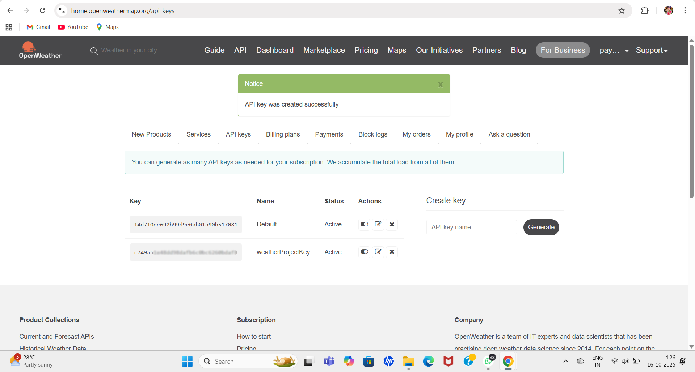

# AWS Weather Alerts

A serverless AWS project that fetches real-time weather data using OpenWeatherMap API and sends alerts via AWS SNS.

---

## 🚀 Features
- ✅ Fetches real-time weather updates using OpenWeatherMap API
- ✅ Sends SMS/Email alerts via AWS SNS
- ✅ Serverless and cost-effective using AWS Lambda
- ✅ Scheduled execution using EventBridge Scheduler
- ✅ Monitors execution and logs using Amazon CloudWatch
- ✅ IAM roles & policies secure AWS resources
- ✅ Easy to customize city and notification preferences

---

## 🔧 Technologies & Services
- **AWS Lambda** - Executes Python script to fetch weather data  
- **Amazon SNS** - Sends notifications to subscribed email/phone  
- **Amazon EventBridge Scheduler** - Triggers Lambda function at scheduled times  
- **Amazon CloudWatch Logs** - Monitors Lambda execution  
- **IAM Roles & Policies** - Grants Lambda permissions to publish to SNS  
- **OpenWeatherMap API** - Provides real-time weather data  

---

## 🚀 Project Setup & Configuration

Here’s a visual walkthrough of how this AWS Weather Notification project was built and configured.

## 🧩 Step 1: OpenWeatherMap API
Created an API key from OpenWeatherMap to fetch real-time weather data.  

- **Service:** OpenWeatherMap  
- **Purpose:** Fetch current weather data via API  

---

## 🖥️ Step 2: AWS Lambda Function
Created a Lambda function to process weather data and send alerts.  

.png)

.png)

displays the Lambda function code editor, where the Python script fetches live weather data using OpenWeatherMap API and publishes notifications through Amazon SNS.

.png)
---

## ☁️ Step 3: Amazon SNS Topic
Configured an SNS topic to send notifications to subscribers. 

Alerts from the Lambda function are published to this SNS topic.  
Subscribers receive notifications via email whenever a message is sent.  
SNS ensures reliable and timely delivery of messages.

.png)

.png) 

---

## 📅 Step 4: Amazon EventBridge Scheduler
Scheduled a rule to trigger the Lambda function at regular intervals.  

- **Service:** Amazon EventBridge (CloudWatch Event)  
- **Frequency:** Every 1 hour  
- **Target:** Lambda function  

---

## 📖 Step 5: Amazon CloudWatch Logs
Monitored Lambda execution logs to ensure proper functioning and debug errors.  

- **Service:** Amazon CloudWatch Logs  
- **Purpose:** View function logs, track errors and notifications  

---

## 🔐 Step 6: IAM Roles & Policies
Attached IAM roles and policies to Lambda for SNS publish permissions.  

- **Service:** AWS IAM  
- **Purpose:** Secure access management for Lambda function  

---

## 💻 Step 7: Testing & Notification
Tested the Lambda function to verify:  

1. Weather data fetched correctly  
2. Alerts sent via SNS to subscribed email  

---